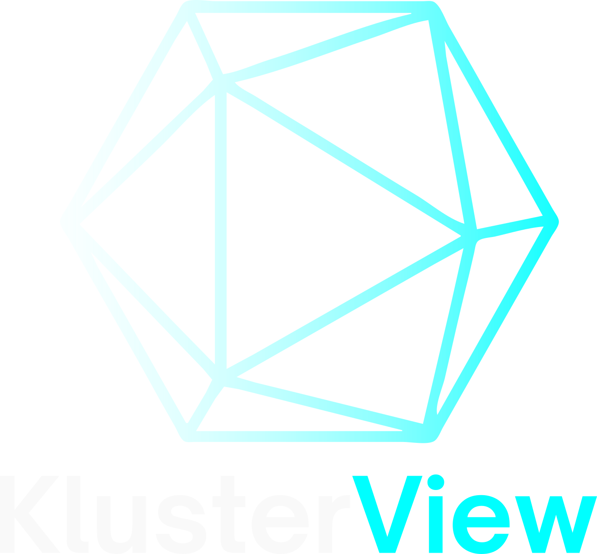

# KlusterView

  <p align="center">
  
  </p>

## Introducing: KlusterView

### A lightweight, ready-to-deploy Kubernetes metrics visualizer for the rest of us

Anyone who works regularly with Kubernetes environments knows that, despite the array of tools on the market for monitoring the health and performance of a cluster, knowing precisely what metrics are meaningful (and how to access them for quick reference) can be challenging. This is doubly true for individual developers as well as small and midsize enterprises without large dedicated DevOps teams: the gold standard for performance monitoring in Kubernetes (and other complex orchestration platfoms), the Prometheus/Grafana/Kube State Metrics (PGK) stack, requires extensive up-front configuration, and offers a dizzying array of metrics and visualization options that can bewilder the uninitiated.

Enter KlusterView: a universally compatible plug-and-play visualization tool that distills the best of what the PGK stack has to offer into a streamlined interface, offering a concise and crystal-clear picture of cluster health without any platform-specific setup or specialized configuration. Users can install KlusterView and its dependencies in a single step (details here), and be up and running in minutes, putting critical performance information within a moment's reach wherever and whenever you access your cluster.

## KlusterView v1.0 offers:

- An embedded dashboard displaying moment-by-moment resource usage (CPU, memory, disk), pod and node health status, and trends in these metrics over a variable time window, rendering any concerns immediately visible
- A schematic representation of cluster nodes and their constitutent pods providing top-line pod-level performance metrics at a glance
- A specialized dashboard for displaying detailed pod-level metrics, including historical resource usage data, to speed identification of container-specific issues
- A **single point of access** to all of this, eliminating the need to expose additional in-cluster tools to the local network

**For those wishing to further integrate KlusterView with existing monitoring tools, we offer:**

- A prebuilt, development-ready application image featuring hot reloading
- A robust front- and back-end testing suite to safeguard core functionality and simplify maintainability
- A fully accessible set of installation scripts and YAML configuration files, categorized and indexed for easy modification

## Installation

Klusterview is built atop the Grafana, Prometheus, and Kube State Metrics packages. The application will look for Grafana and Prometheus as services (by the names `grafana` and `prometheus`) in the `monitoring-kv` namespace, and will assume that Kube State Metrics has been installed on the cluster undergoing monitoring. **Either of the following methods will install each of these packages in the appropriate namespace and under the appropriate name**.

### Helm Chart

KlusterView is most easily installed using its Helm chart, held in this repository. To install via this method, please ensure that the following dependencies are met, and follow the steps below.

#### Prerequesites

- Kubernetes 1.16+
- Helm 3+

#### Get Helm Repository Info

```shell
helm repo add klusterview https://oslabs-beta.github.io/KlusterView/
helm repo update
```

#### Install Helm Chart

```shell
helm install [Name of your choice] klusterview/klusterview
```

### Manual Installation

#### Prerequisites

- Kubernetes 1.16+
- Sufficient privileges to create objects via Kubectl

#### Installation

From the project's `scripts` directory, execute `./setup.sh` with root user permissions. This will intruct Kubectl to install KlusterView and its dependencies using the manifests contained in the `deployment/_manual_install` directory, which are functionally identical to those contained in the Helm chart.

## Accessing the Application

KlusterView will run on Port 31001 of each node. To display the application, access this port directly via your web browser, or use the tool of your choice (port forwarding, tunneling, MiniKube's `service` command, etc.) to forward the relevant port to your `localhost`.

## Contribution and Development Roadmap

The state of current and planned features is as follows:

| Feature                                                                        | Status |
| ------------------------------------------------------------------------------ | ------ |
| Cluster- and node-level resource usage and pod status monitoring               | ✅     |
| Detailed pod-level resource usage and status monitoring                        | ✅     |
| Cluster- and node-level structural information via node graph                  | ✅     |
| Full TypeScript implementation                                                 | ✅     |
| Full support for Grafana Live features                                         | ⏳     |
| In-window support for dashboard customization                                  | ⏳     |
| Integration with Grafana Role-Based Access Control                             | 🙏🏻     |
| Live monitoring of pod-level error and information logs                        | 🙏🏻     |
| Integration with Grafana Alerts Management vis a vis resource usage and status | 🙏🏻     |

- ✅ = Ready to use
- ⏳ = In progress
- 🙏🏻 = Looking for contributors

### Running in Development Mode

Should you wish to contribute to this project (and you are encouraged to!), you may access a live-reloading development server by using our KlusterView development [Docker image](https://hub.docker.com/repository/docker/kyleslugg/klusterview-dev/) in place of that used in production. You may also build this image from source: simply run `docker build -f Dockerfile-dev -t klusterview/dev .`Once loaded, the development server may be accessed on NodePort 31002 in the manner of your choosing.

### Running Tests

To run unit tests on the app server, simply run `npm test` within the development container.

## Meet the Team

  <table>
  <tr>
    <td align="center" >
      
      <br />
      <sub><b>Kyle Slugg</b></sub>
      <br />
      <div style="display:flex; align-items:center; justify-content:center;">
        <a href="http://www.kyleslugg.co"></a>
        <a href="https://www.linkedin.com/in/kyle-slugg/"></a>
        <a href="https://github.com/kyleslugg"></a>
      </div>
    </td>
    <td align="center">
      
      <br />
      <sub><b>Shahmar Aliyev</b></sub>
      <br />
        <div style="display:flex; align-items:center; justify-content:center;">
          <a href="https://shahmaraliyev.com/"></a>
              <a href="https://www.linkedin.com/in/shahmaraliyev/"></a>
              <a href="https://github.com/ShahmarAliyev"></a>
        </div>
    </td>
    <td align="center">
      
      <br />
      <sub><b>Mike Nunn</b></sub>
      <br />
      <div style="display:flex; align-items:center; justify-content:center;">
        <a href="https://www.linkedin.com/in/mikenunn22/"></a>
        <a href="https://github.com/24juice22"></a>
      </div>
    </td>
     <td align="center">
      
      <br />
      <sub><b>Jonathan Tsai</b></sub>
      <br />
      <div style="display:flex; align-items:center; justify-content:center;">
        <a href="https://www.linkedin.com/in/jonathan-tsai95/"></a>
        <a href="https://github.com/jonathantsai1995"></a>
      </div>
    </td>
